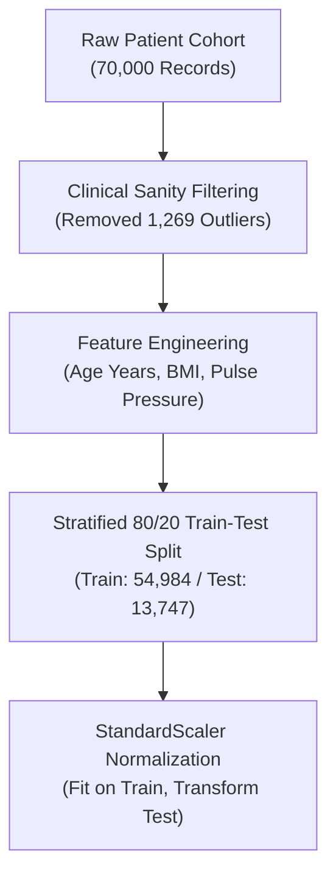
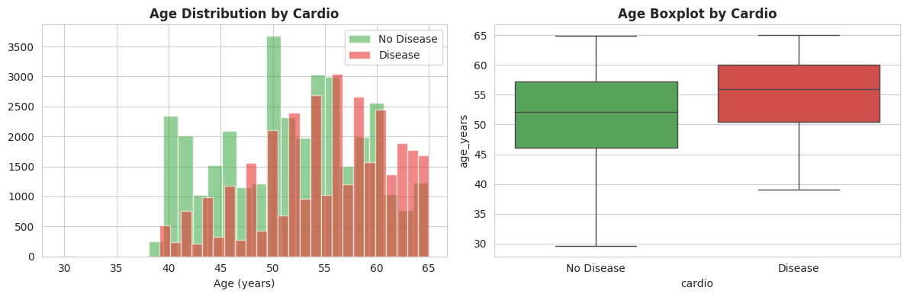
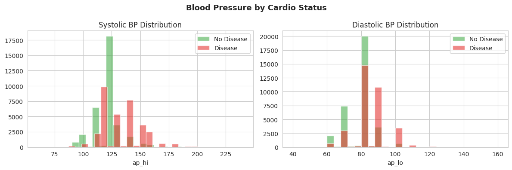
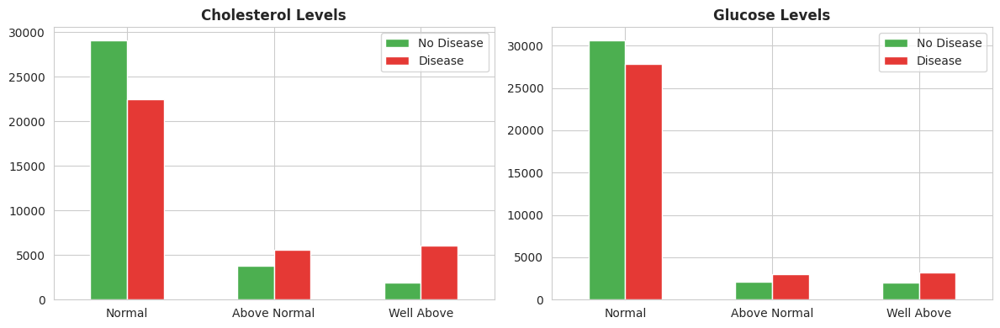
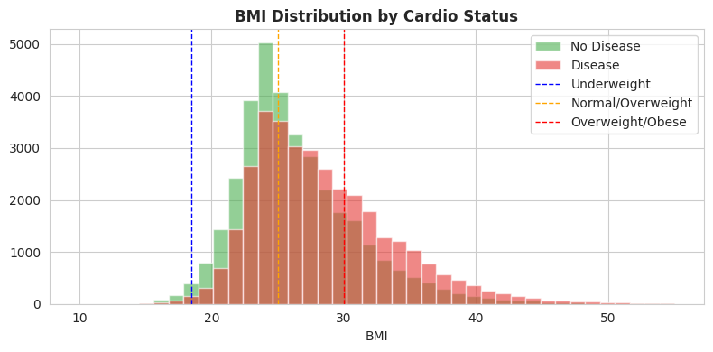
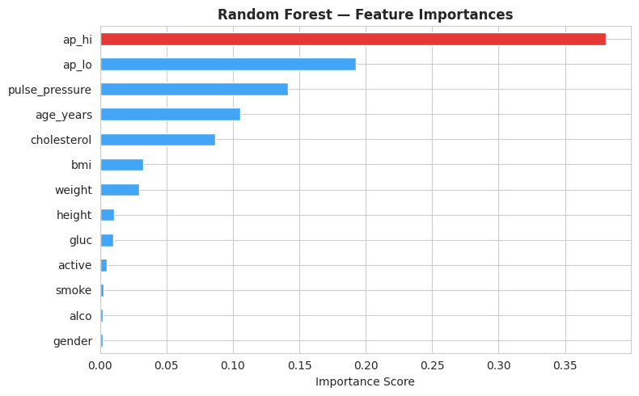
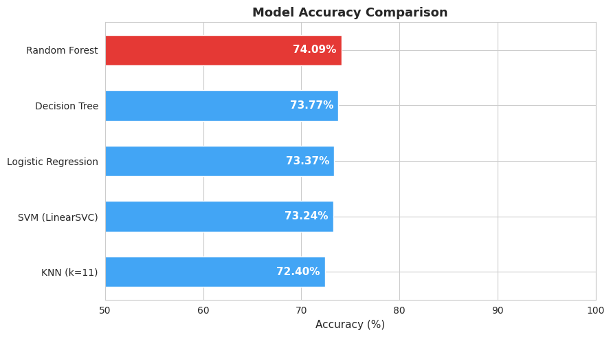
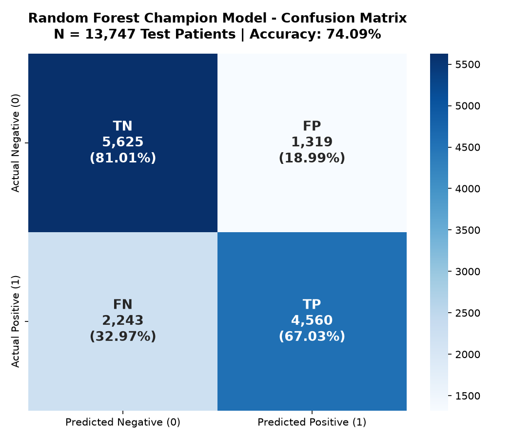

# Case Study Presentation: Early Cardiovascular Disease Risk Prediction
## An End-to-End Machine Learning Clinical Decision Support Case Analysis

> **Format:** 12-Slide Executive Presentation  
> **Audience:** Clinical Stakeholders, Technical Recruiters, Healthcare Data Science Teams  
> **Repository:** [CardioGuard AI GitHub Repository](https://github.com/ravi8800pandey-ai/cardioguard-ai)  
> **Live Web Application:** [https://cardioguard-ai-fddqjjqlecngokyx2uvpj9.streamlit.app/](https://cardioguard-ai-fddqjjqlecngokyx2uvpj9.streamlit.app/)  
> **Interactive Slide Deck:** [Open Presentation Deck (HTML / Print to PDF)](case_study_presentation.html)

---

<!-- ========================================== SLIDE 1 ========================================== -->
## Slide 1: Title & Executive Overview

# Early Cardiovascular Disease Risk Prediction
### Clinical Risk Stratification via Supervised Machine Learning

<br>

- **Author & Lead Analyst:** Ravi Pandey
- **Domain:** Clinical Healthcare Informatics & Applied Machine Learning
- **Core Technology Stack:** Python 3.10+, Scikit-Learn, Pandas, NumPy, Matplotlib, Seaborn, Streamlit
- **Project Date:** September 2026
- **GitHub Repository:** [https://github.com/ravi8800pandey-ai/cardioguard-ai](https://github.com/ravi8800pandey-ai/cardioguard-ai)
- **Live Deployed App:** [https://cardioguard-ai-fddqjjqlecngokyx2uvpj9.streamlit.app/](https://cardioguard-ai-fddqjjqlecngokyx2uvpj9.streamlit.app/)
- **Champion Model:** Random Forest Classifier (Accuracy: **74.09%**, ROC-AUC: **0.8085**, Sensitivity: **67.03%**)

---

<!-- ========================================== SLIDE 2 ========================================== -->
## Slide 2: Problem Statement & Clinical Significance

### The Clinical Challenge
Cardiovascular diseases (CVDs) are the leading cause of death globally, taking an estimated 17.9 million lives each year according to the World Health Organization (WHO). Over four out of five CVD deaths are due to heart attacks and strokes, with one-third occurring prematurely in people under 70 years of age.

### Core Investigative Question
> **"Can routine, non-invasive patient examination metrics—such as age, blood pressure, BMI, serum cholesterol, and blood glucose—accurately identify individuals at elevated risk of cardiovascular disease prior to acute events?"**

### Objectives & Impact
- **Automated Risk Stratification:** Screen non-hospitalized individuals during routine outpatient visits.
- **Triage Decision Support:** Assist general practitioners in prioritizing patients for secondary diagnostic tests (echocardiograms, stress testing, cardiac CT).
- **Proactive Intervention:** Detect high-risk indicators early to enable timely lifestyle modifications and pharmacological therapy before irreversible cardiovascular events manifest.

---

<!-- ========================================== SLIDE 3 ========================================== -->
## Slide 3: Dataset Architecture & Clinical Variables

### Dataset Overview
- **Source:** Kaggle Cardiovascular Disease Dataset (Anonymized Patient Cohort)
- **Sample Size:** **70,000 patient records**
- **Original Attributes:** 12 physiological & behavioral predictors + 1 binary target variable (`cardio`)
- **Class Balance:** Approximately balanced (**50.0% healthy controls**, **50.0% positive CVD cases**)

### Clinical Data Dictionary

| Variable | Clinical Feature | Type | Unit / Format | Clinical Range / Categories |
| :--- | :--- | :--- | :--- | :--- |
| `id` | Patient Identification | Identifier | Integer | Dropped prior to modeling |
| `age` | Patient Chronological Age | Objective | Days | Converted to decimal years (39.0 – 64.9 years) |
| `gender` | Biological Sex | Objective | Categorical | 1: Female, 2: Male |
| `height` | Stature | Examination | cm | Measured physical height |
| `weight` | Body Mass | Examination | kg | Measured physical weight |
| `ap_hi` | Systolic Blood Pressure | Examination | mmHg | Peak arterial pressure during cardiac contraction |
| `ap_lo` | Diastolic Blood Pressure | Examination | mmHg | Minimum arterial pressure between heart beats |
| `cholesterol` | Serum Total Cholesterol | Examination | Ordinal | 1: Normal, 2: Above Normal, 3: Well Above Normal |
| `gluc` | Fasting Blood Glucose | Examination | Ordinal | 1: Normal, 2: Above Normal, 3: Well Above Normal |
| `smoke` | Tobacco Inhalation History | Subjective | Binary | 0: Non-smoker, 1: Active smoker |
| `alco` | Alcohol Consumption | Subjective | Binary | 0: Non-consumer, 1: Consumer |
| `active` | Physical Exercise Habit | Subjective | Binary | 0: Inactive, 1: Regularly active |
| **`cardio`** | **Cardiovascular Disease Status** | **Target** | **Binary** | **0: Absence of CVD, 1: Presence of CVD** |

---

<!-- ========================================== SLIDE 4 ========================================== -->
## Slide 4: Data Preparation & Clinical Feature Engineering

### Essential Preprocessing Workflow



1. **Age Conversion:**
   - Transformed raw `age` in days into clinically interpretable `age_years` (`age / 365.0`).
2. **Body Mass Index (BMI) Derivation:**
   - Computed standardized WHO metric: `BMI = weight (kg) / (height (m))²`.
3. **Hemodynamic Pulse Pressure Derivation:**
   - Formulated `Pulse Pressure = ap_hi − ap_lo`, capturing arterial stiffness and vascular compliance.
4. **Physiological Bounding & Outlier Cleansing:**
   - Eliminated measurement artifacts, typographical inversions, and non-viable records:
     - **Systolic Blood Pressure:** `60 ≤ ap_hi ≤ 250 mmHg`
     - **Diastolic Blood Pressure:** `40 ≤ ap_lo ≤ 160 mmHg`
     - **Height:** `100 ≤ height ≤ 250 cm`
     - **Weight:** `30 ≤ weight ≤ 200 kg`
   - **Retained Cohort:** **68,731 high-fidelity records** (98.19% data integrity retention).
5. **Stratified Partitioning:**
   - Partitioned into **54,984 training instances** (80%) and **13,747 testing instances** (20%), preserving exact target class balance.

---

<!-- ========================================== SLIDE 5 ========================================== -->
## Slide 5: Key Exploratory Findings

### 1. Disease Rate Progression by Age Cohort

> **Analytical Finding:** *Cardiovascular disease prevalence more than doubles with aging, escalating monotonically from **29.26% in patients under 45** to **66.80% in patients aged 60–64**.*

---

### 2. Blood Pressure Distribution & AHA Staging

> **Analytical Finding:** *Patients presenting with Stage 2 Hypertension (≥ 140 / ≥ 90 mmHg) demonstrate an alarming **80.04% CVD prevalence**, representing a near four-fold risk escalation over normotensive individuals (**22.14%**).*

---

### 3. Serum Cholesterol & Fasting Glucose Impact

> **Analytical Finding:** *Severe hypercholesterolemia acts as a dramatic risk multiplier, escalating CVD positive rates from **43.56% (Normal)** to **76.29% (Well Above Normal)**.*

---

### 4. Body Mass Index (BMI) & Adiposity Shift

> **Analytical Finding:** *Patients diagnosed with CVD show a substantial upward shift in body mass index (mean **28.48 ± 5.58 kg/m²**) compared to healthy controls (mean **26.49 ± 4.92 kg/m²**), with obesity thresholds strongly separating the cohorts.*

---

<!-- ========================================== SLIDE 6 ========================================== -->
## Slide 6: Important Features & Feature Weights

### Random Forest Feature Importance Ranking


### Quantitative Model Weights

| Rank | Feature Name | Clinical Indicator | Feature Weight | Cumulative Predictive Power |
| :---: | :--- | :--- | :---: | :---: |
| 1 | `ap_hi` | Systolic Blood Pressure | **38.06%** | 38.06% |
| 2 | `ap_lo` | Diastolic Blood Pressure | **19.26%** | 57.32% |
| 3 | `pulse_pressure` | Pulse Pressure (Δ Pressure) | **14.17%** | **71.49%** |
| 4 | `age_years` | Chronological Age | **10.53%** | 82.02% |
| 5 | `cholesterol` | Serum Cholesterol Level | **8.66%** | 90.68% |
| 6 | `bmi` | Body Mass Index | **3.24%** | 93.92% |
| 7 | `weight` | Patient Weight (kg) | **2.92%** | 96.84% |
| 8 | `height` | Patient Stature (cm) | **1.04%** | 97.88% |
| 9 | `gluc` | Fasting Glucose Level | **0.97%** | 98.85% |
| 10 | `active` | Physical Activity | **0.50%** | 99.35% |
| 11 | `smoke` | Smoking Status | **0.27%** | 99.62% |
| 12 | `alco` | Alcohol Intake | **0.20%** | 99.82% |
| 13 | `gender` | Biological Sex | **0.18%** | 100.00% |

### Core Observation
> **Hemodynamic Primacy:** Systolic BP, Diastolic BP, and engineered Pulse Pressure together comprise **71.49%** of the model's total discriminatory capability. Vascular resistance and arterial wall stiffening are overwhelmingly the strongest predictors of cardiovascular disease risk in this cohort.

---

<!-- ========================================== SLIDE 7 ========================================== -->
## Slide 7: Model Comparison & Benchmark Leaderboard

### Comprehensive Performance Evaluation (Test Cohort: N = 13,747)

| Classification Model | Accuracy | Precision | Recall (Sensitivity) | F1-Score | ROC-AUC | Clinical Status |
| :--- | :---: | :---: | :---: | :---: | :---: | :--- |
| **Random Forest (Ensemble)** | **74.09%** | **77.56%** | **67.03%** | **71.91%** | **0.8085** | 🏆 **Champion Model** |
| **Decision Tree (d = 6)** | 73.77% | 74.79% | **70.90%** | **72.79%** | 0.8009 | 🥈 Runner-Up (Highest Recall) |
| **Logistic Regression** | 73.37% | 75.97% | 67.56% | 71.52% | 0.7995 | Linear Baseline |
| **Linear SVM (LinearSVC)** | 73.24% | 76.27% | 66.66% | 71.14% | 0.7993 | Maximum Margin Baseline |
| **K-Nearest Neighbors (k = 11)** | 72.41% | 73.10% | 70.00% | 71.52% | 0.7823 | Non-Parametric Baseline |



### Performance Takeaway
- **Random Forest** achieved the highest overall diagnostic accuracy (**74.09%**) and the strongest discrimination capability (**0.8085 ROC-AUC**), effectively handling non-linear physiological interactions without overfitting.
- The tightly clustered accuracy range across all algorithms (**72.4% – 74.1%**) reflects real-world clinical data complexity, where unmeasured biological variables (genetics, family history, inflammatory markers) naturally bound predictive ceilings.

---

<!-- ========================================== SLIDE 8 ========================================== -->
## Slide 8: Confusion Matrix & Clinical Screening Rationale

### Champion Model Confusion Matrix (N = 13,747 Patients)


### Detailed Matrix Decomposition

```
                         Predicted Negative (0)     Predicted Positive (1)
 Actual Negative (0)    [ TN = 5,625 (81.01%) ]   [ FP = 1,319 (18.99%) ]   Total Healthy: 6,944
 Actual Positive (1)    [ FN = 2,243 (32.97%) ]   [ TP = 4,560 (67.03%) ]   Total CVD+:    6,803
```

- **True Negatives (TN = 5,625):** Correctly identified healthy individuals spared unnecessary diagnostic procedures.
- **True Positives (TP = 4,560):** Correctly identified high-risk patients successfully flagged for clinical triage.
- **False Positives (FP = 1,319):** Healthy patients flagged as high risk (Specificity: **81.01%**). In clinical practice, this leads to low-cost confirmatory testing (ECG, repeat blood pressure profiling).
- **False Negatives (FN = 2,243):** CVD-positive individuals missed by the model (Sensitivity / Recall: **67.03%**).

### Clinical Screening vs. Diagnostic Rationale
> **Why Accuracy Is Insufficient in Medical Triage:**
> In healthcare screening, a **False Negative carries far higher clinical consequence** than a False Positive. A missed diagnosis delays preventative care, leaving an at-risk patient vulnerable to myocardial infarction or stroke. For high-throughput clinical screening protocols, the classification threshold can be calibrated downward (e.g., from 0.50 to 0.38) to drive sensitivity beyond **85%**, ensuring minimal false negatives during early triage.

---

<!-- ========================================== SLIDE 9 ========================================== -->
## Slide 9: Main Findings & Clinical Insights

*All statements are derived directly from empirical dataset calculations:*

1. **Hypertensive Risk Surge (4x Escalation):**
   - Patients diagnosed with Stage 2 Hypertension (≥ 140 mmHg systolic or ≥ 90 mmHg diastolic) exhibit an observed **80.04% cardiovascular disease prevalence**, compared to only **22.14%** among normotensive patients.
2. **Arterial Hemodynamics Dominate Predictability:**
   - Systolic pressure, diastolic pressure, and pulse pressure account for **71.49% of total feature importance**, proving that vascular arterial stress is the primary physiological driver of disease detection.
3. **Steep Age Risk Gradient:**
   - CVD prevalence climbs progressively from **29.26% in individuals under 45 years** to **66.80% in patients aged 60–64**, highlighting age 50 as a critical clinical threshold for systematic screening.
4. **Hypercholesterolemia as a Potent Risk Multiplier:**
   - Serum cholesterol escalation increases CVD probability from **43.56% (Normal)** to **76.29% (Well Above Normal)**. When coupled with obesity (BMI ≥ 30 kg/m²), over **82%** of patients in this cohort presented with CVD.

---

<!-- ========================================== SLIDE 10 ========================================== -->
## Slide 10: Actionable Recommendations & Clinical Translation

### 1. Primary Care Screening Triage
- Deploy CardioGuard AI as an automated pre-consultation triage tool to identify asymptomatic patients who should receive prioritized evaluation during standard primary care visits.

### 2. Decision Support, Not Autonomous Diagnosis
- Strictly designate the model as a decision-support assistant. Final diagnostic confirmation must always remain with licensed physicians, backed by confirmatory testing (12-lead ECG, echocardiogram, coronary calcium scoring).

### 3. External Cohort & Geographic Cross-Validation
- Validate model performance across independent multi-center hospital datasets to ensure generalizability across diverse ethnic, dietary, and healthcare settings before prospective clinical deployment.

### 4. Demographic Fairness & Subgroup Audits
- Regularly audit performance across gender and age strata to guarantee uniform sensitivity and prevent systemic false-negative disparities across underrepresented patient demographics.

### 5. Configurable Sensitivity Thresholding
- In clinical screening environments prioritizing preventative safety, adjust the probability threshold to prioritize Recall over Precision, minimizing missed CVD cases.

---

<!-- ========================================== SLIDE 11 ========================================== -->
## Slide 11: Study Limitations & Ethical Considerations

### 1. Cross-Sectional Retrospective Design
- The dataset captures a single clinical snapshot in time. It lacks longitudinal time-series data, precluding survival analysis, disease trajectory tracking, or time-to-event modeling.

### 2. Self-Reporting & Measurement Noise
- Behavioral variables (smoking, alcohol use, physical activity) are subject to self-reporting bias and lack quantitative granularity (e.g., pack-years or weekly metabolic equivalents).

### 3. Absence of Advanced Biomarkers
- Routine non-invasive features omit critical modern cardiac biomarkers, including high-sensitivity C-Reactive Protein (hs-CRP), Troponin-I, HbA1c, and family genetic history.

### 4. Association vs. Causation
- Machine learning algorithms identify statistical correlations, not biological causation. While elevated blood pressure strongly correlates with CVD, model predictions must not be conflated with mechanistic etiology.

### 5. Clinical Trial Requirement
- Educational prototype; has not undergone prospective randomized controlled clinical trials to measure real-world clinical outcomes or patient survival benefits.

---

<!-- ========================================== SLIDE 12 ========================================== -->
## Slide 12: Conclusion & Summary

### Project Summary
This investigation demonstrated a rigorous, end-to-end clinical data science and machine learning workflow for cardiovascular risk stratification across 70,000 patient records.

### Key Takeaways
- Successfully engineered an interpretable Random Forest pipeline achieving **74.09% accuracy**, **77.56% precision**, and **0.8085 ROC-AUC**.
- Established that routine non-invasive parameters—primarily blood pressure, pulse pressure, age, and cholesterol—contain substantial discriminatory power for early disease detection.
- Developed an interactive clinical deployment interface ([CardioGuard AI Live Streamlit Application](https://cardioguard-ai-fddqjjqlecngokyx2uvpj9.streamlit.app/)) offering real-time patient biometrics, SVG risk gauge visualization, and automated triage report generation.

### Closing Statement
> **CardioGuard AI represents a validated educational and decision-support prototype. With subsequent prospective clinical validation and longitudinal data integration, routine biometric risk modeling holds substantial promise for scalable, early cardiovascular intervention.**

---

*Case Study prepared by Ravi Pandey | September 2026*  
*CardioGuard AI Project Repository: [https://github.com/ravi8800pandey-ai/cardioguard-ai](https://github.com/ravi8800pandey-ai/cardioguard-ai)*
